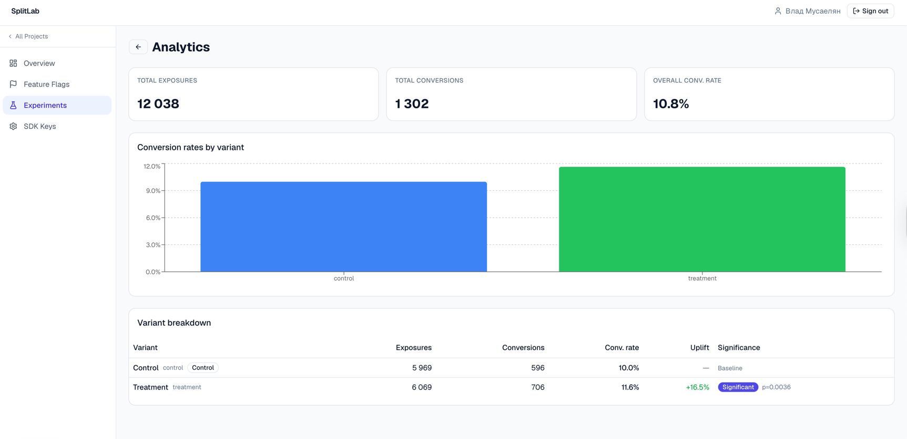

# SplitLab — A/B Testing & Feature Flag Platform

A self-hosted platform for managing feature flags and running A/B experiments.

**Core capabilities:**

- Feature flag management with percentage rollout and kill switch
- A/B/n experiment lifecycle (draft → running → paused → completed)
- Deterministic, stable user assignment via MurmurHash3
- Exposure and conversion event collection through a Kafka pipeline
- Statistical analysis: two-proportion z-test, uplift %, 95% CI, p-value
- Go SDK for client integration with local evaluation and async event buffering
- Admin UI for managing flags, experiments, and reviewing analytics
- Demo app + k6 load generator for end-to-end validation



---

## Architecture

```
┌──────────────────┐  Firebase JWT   ┌─────────────────────────────────────┐
│   Admin UI       │ ─────────────►  │  Backend  :8080/api/v1              │
│   Next.js 14     │                 │  gorilla/mux  +  oapi-codegen       │
└──────────────────┘                 │                                     │
                                     │  Control plane    SDK plane         │
┌──────────────────┐  X-API-Key      │  /projects        /sdk/config       │
│   Go SDK         │ ─────────────►  │  /flags           /sdk/events       │
│   (embedded in   │                 │  /experiments                       │
│    your app)     │                 │  /analytics                         │
└──────────────────┘                 └────────────┬────────────────────────┘
                                                  │
                         ┌────────────────────────┼──────────────────────┐
                         ▼                        ▼                      ▼
                   PostgreSQL 16            Kafka 3.7               Redis 7.2
                   (primary store)      (event pipeline)         (config cache)
                         ▲
                   ┌─────┴──────┐
                   │  Consumer  │   Kafka → PostgreSQL bulk insert
                   └────────────┘
```

### Assignment algorithm

```
bucket = MurmurHash3_32(userID + ":" + experimentKey) % 10_000
```

The same formula runs in both the backend and the Go SDK — a user always lands in the same variant regardless of which side evaluates the assignment.

### Event flow

```
SDK.GetVariant()  →  exposure event  ─┐
SDK.Track()       →  conversion event ─┴─►  POST /sdk/events  ►  Kafka  ►  Consumer  ►  PostgreSQL
```

Analytics are computed on-demand from the raw events table using SQL aggregation + z-test.

---

## Monorepo Layout

```
ab-test-system/
├── backend/                  # Go service — control plane + SDK plane + event consumer
├── frontend/                 # Next.js 14 admin UI
├── sdk/                      # Go SDK library (separate Go module)
├── demo/                     # Demo storefront app that uses the SDK
│   ├── backend/              # Go HTTP server
│   └── static/               # Vanilla HTML frontend (no build step)
├── k6/                       # k6 traffic generator scripts
│   └── scenarios/
├── infra/
│   └── terraform/
│       ├── modules/          # Reusable generic modules (iam, vpc, cloud_sql, …)
│       └── environments/
│           ├── staging/      # Staging values — small tiers, no SSL
│           └── production/   # Production values — HA, custom domain, deletion protection
├── .github/
│   └── workflows/
│       ├── lint.yml          # golangci-lint for backend + sdk
│       ├── test.yml          # go test -race for backend + sdk
│       ├── deploy.yml        # build + push + deploy (staging on main, production on tag)
│       ├── terraform-plan.yml   # plan on PRs, posts diff as PR comment
│       └── terraform-apply.yml  # manual dispatch — choose staging or production
└── Makefile                  # Top-level convenience targets (demo-setup, demo-run, demo-k6)
```

Each component has its own README:

| Component | README |
|---|---|
| Backend | [backend/README.md](backend/README.md) |
| Go SDK | [sdk/README.md](sdk/README.md) |
| Demo app | [demo/README.md](demo/README.md) |

---

## Quick Start

### 1. Start the backend

```bash
cd backend
make dev          # starts infra, migrates, runs server + consumer
```

### 2. Start the admin UI

```bash
cd frontend
pnpm install
pnpm dev          # http://localhost:3000
```

### 3. Run the demo end-to-end

```bash
# Seed platform resources and write demo/.env
export FIREBASE_TOKEN=<token from DevTools → Cookies>
make demo-setup

# Start the demo store
make demo-run     # http://localhost:8081

# Generate synthetic traffic with k6
make demo-k6
```

See [demo/README.md](demo/README.md) for the full walkthrough.

---

## Statistical Analysis

Experiment results are computed using a **two-proportion z-test** on the raw exposure and conversion counts:

| Metric | Formula |
|---|---|
| Conversion rate | conversions / exposures |
| Uplift | (CR_treatment − CR_control) / CR_control |
| z-statistic | (p̂₁ − p̂₂) / SE(p̂₁ − p̂₂) |
| p-value | two-tailed from standard normal |
| 95% CI | (p̂₁ − p̂₂) ± 1.96 × SE |
| Significant | p-value < 0.05 |

---

## Infrastructure

The platform runs on GCP and is fully described in Terraform under `infra/terraform/`.

### Module layout

```
infra/terraform/
├── modules/
│   ├── iam/              # Service account + project IAM bindings
│   ├── vpc/              # VPC network, subnet, VPC Access Connector, private services peering
│   ├── artifact_registry/# Docker registry + IAM (writers / readers)
│   ├── secret_manager/   # Secret + version + accessor IAM bindings
│   ├── cloud_sql/        # PostgreSQL (private IP, backups, optional HA)
│   ├── redis/            # Memorystore Redis (BASIC or STANDARD_HA)
│   ├── kafka/            # Managed Apache Kafka cluster + topics
│   ├── cloud_run/        # Cloud Run v2 service (server or consumer pattern)
│   ├── load_balancer/    # Global LB → Serverless NEG → Cloud Run + SSL cert
│   └── ci/               # Workload Identity Pool + GitHub OIDC provider binding
└── environments/
    ├── staging/          # staging values: small tiers, no SSL cert, deletion_protection=false
    └── production/       # production values: HA, larger tiers, custom domain, deletion_protection=true
```

Modules are generic resource definitions — they contain no environment-specific values.
All values (names, sizes, CIDRs, feature flags) live exclusively in `environments/`.

---

## Deployment

### CI/CD workflows

```
.github/workflows/
├── lint.yml             # golangci-lint for backend + sdk
├── test.yml             # go test -race for backend + sdk
├── deploy.yml           # build images → push to Artifact Registry → Cloud Run
├── terraform-plan.yml   # terraform plan on PRs, posts output as PR comment
└── terraform-apply.yml  # manual dispatch — choose staging or production
```

### Trigger rules

| Event | Workflows triggered |
|---|---|
| Pull request → `main` | lint, test, terraform-plan (if `infra/terraform/**` changed) |
| Push to `main` | lint, test, build & push → deploy staging |
| Push tag `v*` | build & push → deploy production |
| Manual dispatch | terraform-apply (select environment) |

### Deploy flow

```
push main
  ├─► lint (backend + sdk)
  ├─► test (backend + sdk)
  └─► build-staging
        build & push server:SHA → Artifact Registry
        build & push consumer:SHA → Artifact Registry
          └─► deploy-staging
                splitlab-server:SHA  → Cloud Run (staging)
                splitlab-consumer:SHA → Cloud Run (staging)

git tag v1.2.0 && git push --tags
  └─► build-production
        build & push server:SHA + server:v1.2.0 → Artifact Registry
        build & push consumer:SHA + consumer:v1.2.0 → Artifact Registry
          └─► [required reviewer approval — GitHub Environment: production]
                deploy-production
                  splitlab-server:SHA  → Cloud Run (production)
                  splitlab-consumer:SHA → Cloud Run (production)
```

Staging and production are independent pipelines. A production tag does not require staging to pass first; if a promotion model is needed (same image across envs), images can be re-tagged instead of rebuilt. Production images receive two tags: an immutable SHA and a human-readable version tag (`v1.2.0`).

### Terraform workflow

```bash
# First-time setup — run once manually to bootstrap state bucket and initial resources
cd infra/terraform/environments/staging
terraform init
terraform apply

# After that — all changes go through CI:
# 1. Open PR with infra changes → terraform-plan posts plan diff to PR
# 2. Merge PR → review plan output
# 3. Run terraform-apply workflow manually (Actions → Terraform Apply → Run workflow)
```

---

## License

[MIT](LICENSE) © 2025 Vlad Musaelyan
