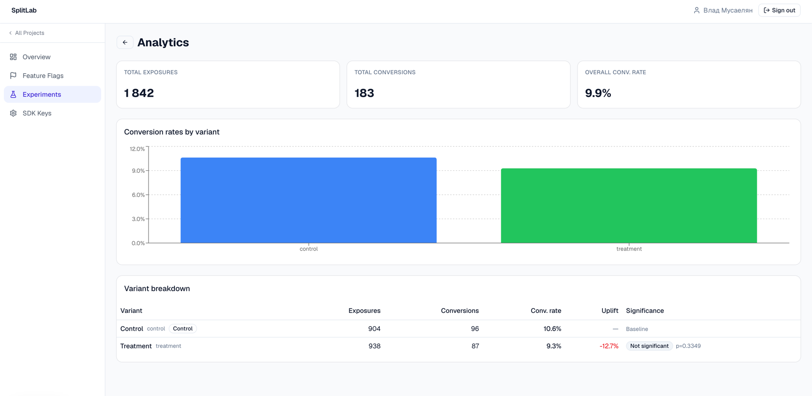
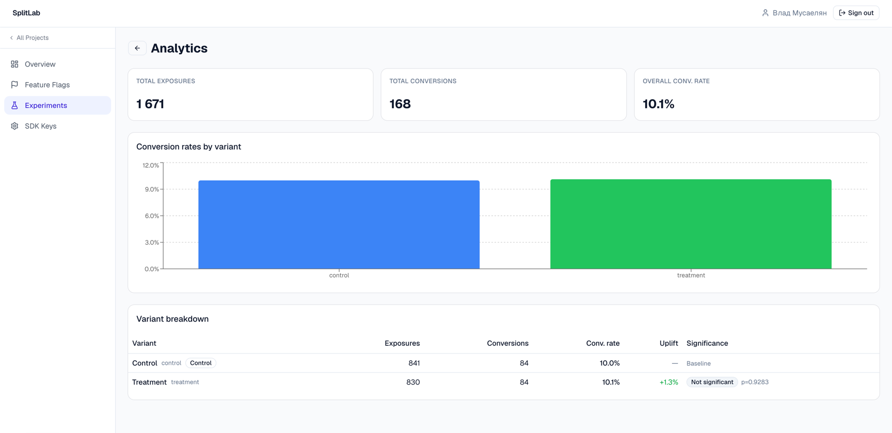
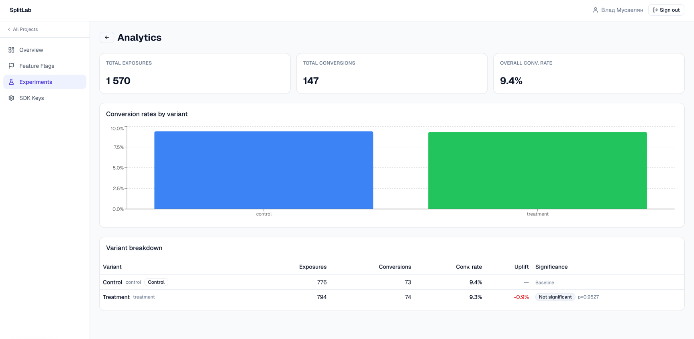
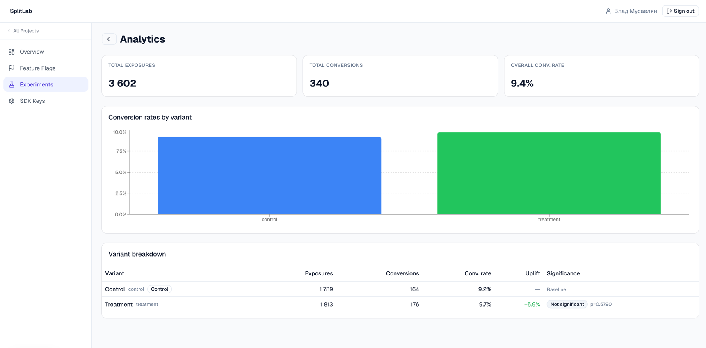
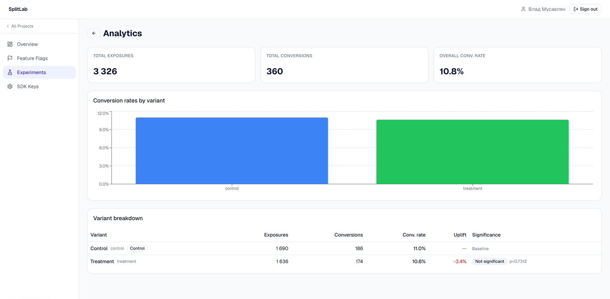
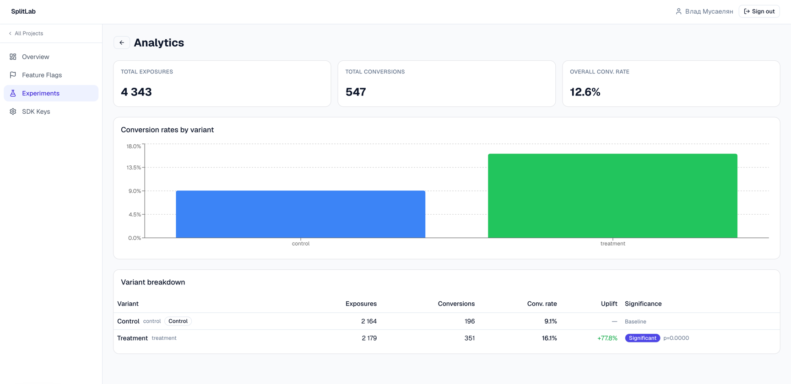

# SplitLab Demo App

A minimal e-commerce storefront that demonstrates the full SplitLab A/B testing loop end-to-end:

1. A user visits the page → the Go SDK assigns them to the `control` or `treatment` variant of the `checkout-btn` experiment
2. The variant determines the button label and colour shown
3. On purchase, a `conversion` event is tracked
4. The SplitLab analytics dashboard shows live uplift, p-value, and confidence intervals

The demo is intentionally small — one product, one experiment, one conversion event — to keep the focus on the platform mechanics rather than the application.

## What's Inside

```
demo/
├── backend/            # Go HTTP server — uses the SplitLab Go SDK
│   ├── main.go         # startup, graceful shutdown
│   ├── config.go       # env-var config
│   ├── handler.go      # /visit  /convert  /flag  /health
│   ├── server.go       # mux wiring; serves static/ from disk
│   └── cmd/seed/       # one-shot setup script (org → project → experiment → SDK key)
└── static/
    └── index.html      # SplitLab Demo Store UI (vanilla HTML + JS, no build step)
```

The backend exposes four endpoints:

| Endpoint | What it does |
|---|---|
| `GET /visit?user_id=<id>` | Calls `sdk.GetVariant` and returns the assigned variant |
| `POST /convert` | Calls `sdk.Track("purchase", ...)` |
| `GET /flag?user_id=<id>` | Calls `sdk.IsEnabled` for the feature flag |
| `GET /health` | Liveness probe |

The frontend (`static/index.html`) is served by the same Go process. It calls these endpoints via `fetch` — no CORS required.

## Prerequisites

- Go 1.23+
- A running SplitLab backend (`cd backend && make dev`)
- A Firebase account token (to authenticate with the admin API during seed)
- k6 installed (`brew install k6`) — only for load testing

## Setup

### 1. Start the SplitLab backend

```bash
cd backend
make dev
```

The backend must be running and healthy before the seed script can create resources.

### 2. Get a Firebase token

1. Open `http://localhost:3000` in a browser
2. Log in with your Google account
3. Open DevTools → Application → Cookies → copy the value of `firebase-token`

### 3. Seed the platform

From the **repo root**:

```bash
export FIREBASE_TOKEN=<paste token here>
make demo-setup
```

The seed script (`demo/backend/cmd/seed/main.go`) is idempotent — safe to run multiple times. It:

- Resolves your organisation from `/users/me`
- Creates (or finds) a project named `SplitLab Demo`
- Creates (or finds) an experiment named `checkout-btn` with `control` / `treatment` variants
- Starts the experiment if it is still in `draft` state
- Creates a new SDK key
- Writes `demo/.env` with `SDK_API_KEY` and `SDK_SERVICE_URL`

### 4. Run the demo server

```bash
make demo-run
```

Open `http://localhost:8081`. You will see the SplitLab Demo Store.

Enter any user ID (or click **Random**), then click **Load** to fetch the variant assignment.
Click the coloured button to simulate a purchase and record a conversion.

- Blue **"Buy Now"** button → `control` variant
- Green **"Get It Now"** button → `treatment` variant
- Grey button → user is outside the traffic allocation

## Validation Scenarios

Five scenarios were run against the demo to validate the platform's correctness and performance.

---

### Scenario A — Small Effect Detection

CR_control = 10%, CR_treatment = 12% (+20% relative uplift), 50 VUs, 3 min.
Validates that the platform correctly detects a real but modest conversion rate difference.


---

### Scenario B — False Positive Rate Validation

CR_control = CR_treatment = 10% (no real effect), 5 independent runs.
Validates that the platform does not report significance when there is no difference.
At α = 0.05 the expected false positive rate is ≤ 5% — at most 1 out of 5 runs.

Result: **0 out of 5 runs** produced a significant result.







---

### Scenario C — Large Effect Detection & Time-to-Significance

CR_control = 10%, CR_treatment = 15% (+50% relative uplift), 50 VUs, 3 min.
Validates that a large effect is detected quickly. Significance was reached within the first 2 minutes.



---

### Scenario D — Deterministic Assignment & Bucket Uniformity

**Algorithm level** (`sdk/evaluate_test.go`):
- 1 000 users × 5 repeated `evaluateExperiment` calls — 0 inconsistencies (PASS)
- Chi-square test on 100 000 synthetic users across 10 000 buckets — uniform within 3σ (PASS)

**HTTP level** (`demo/cmd/sticky`):
- 1 000 users × 5 repeated `GET /visit` calls — 0 inconsistencies (100% sticky bucketing)
- Distribution: control 516 (51.6%) vs treatment 484 (48.4%)
- Two-proportion z-test H₀: p = 0.5 → p-value = 0.3116 (cannot reject equal split, PASS)

---

### Scenario E — Platform Performance

Benchmarks run on Apple M2 Pro (`sdk/sdk_bench_test.go`):

| Metric | Result |
|---|---|
| `sdk.GetVariant` (cache lock + MurmurHash3) | ~1 031 ns/op |
| `assignBucket` (pure MurmurHash3) | ~78 ns/op |
| `GET /sdk/config` p95 | < 50 ms |
| `POST /sdk/events` p95 | < 100 ms |

## Environment Variables

The demo server reads these from `demo/.env` (written by `make demo-setup`):

| Variable | Default | Description |
|---|---|---|
| `SDK_API_KEY` | — | Required. SDK key created by the seed script |
| `SDK_SERVICE_URL` | `http://localhost:8080/api/v1` | SplitLab backend URL |
| `PORT` | `8081` | Port for the demo HTTP server |
| `EXPERIMENT_KEY` | `checkout-btn` | Experiment to evaluate on `/visit` |
| `FLAG_KEY` | `new-checkout` | Feature flag to evaluate on `/flag` |
| `STATIC_DIR` | `../static` | Path to the static HTML directory |

`demo/.env` is gitignored — it contains your real SDK API key.
