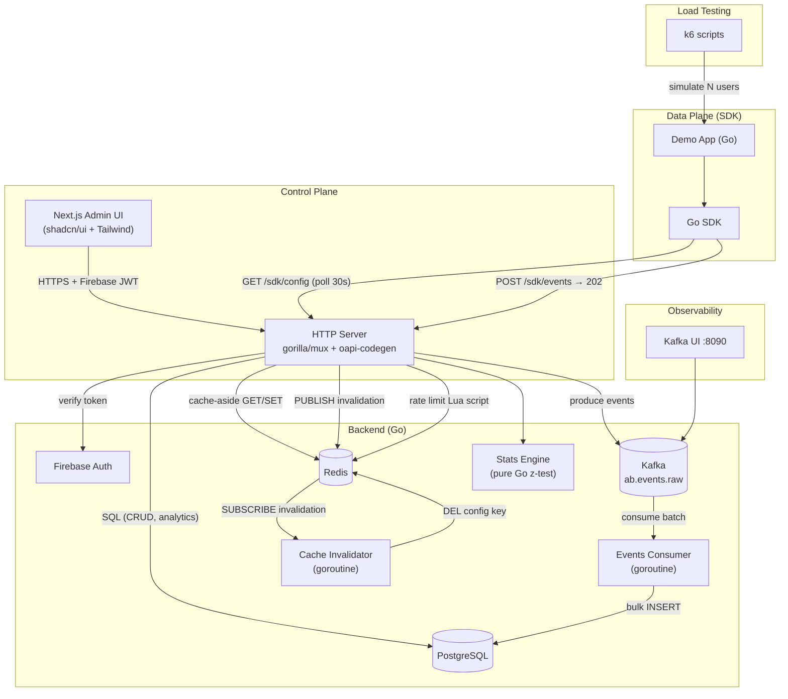
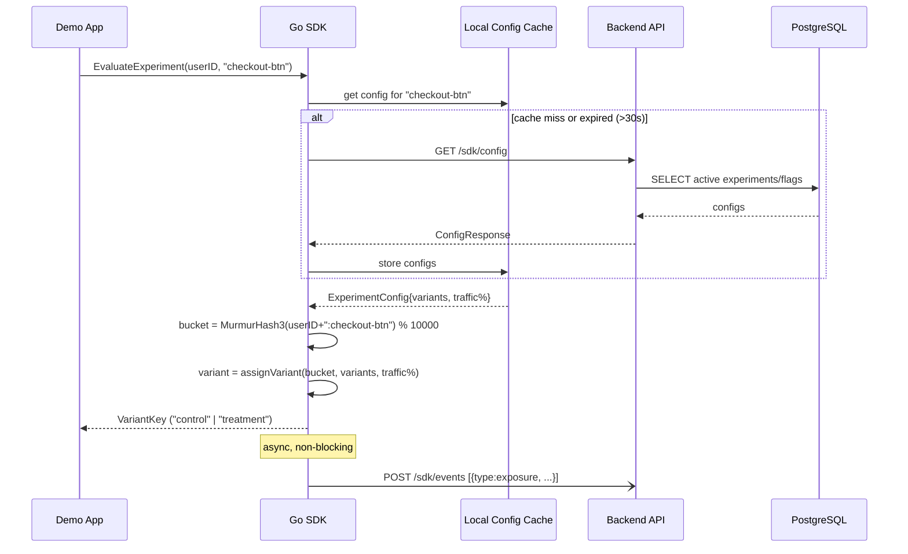
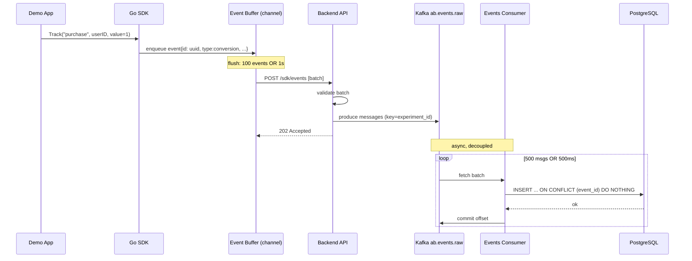
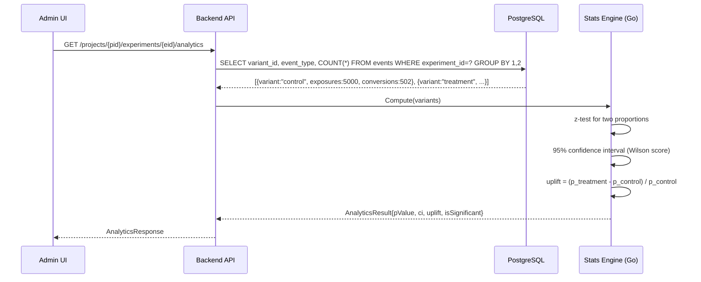
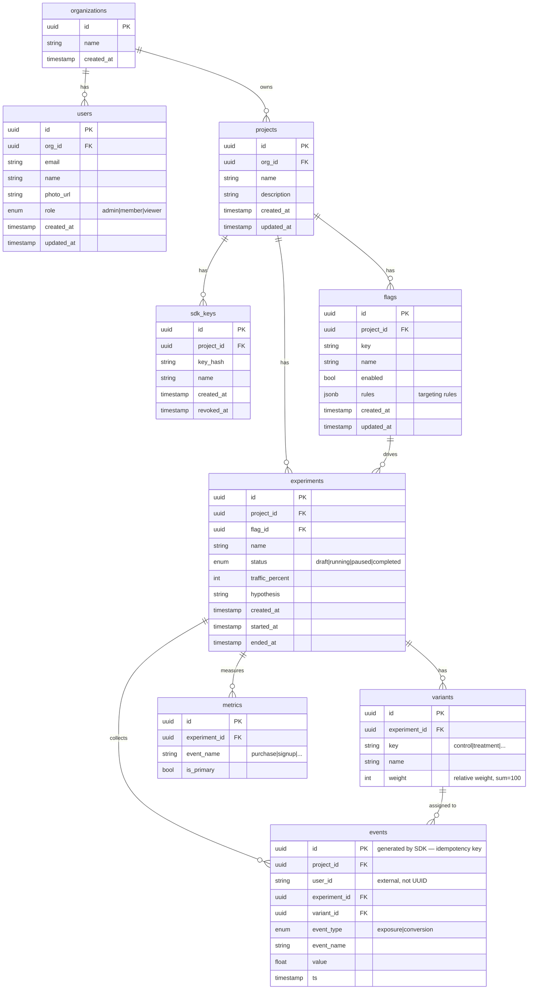
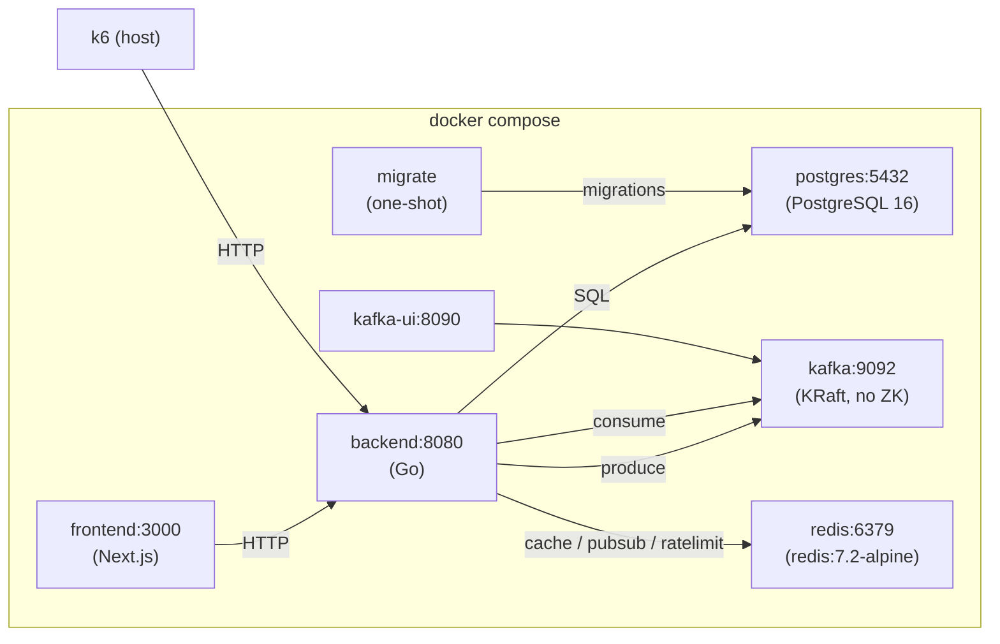

# System Architecture

## Overview

AB Test Platform is a self-hosted feature flag and A/B experiment management system.
It is divided into two planes:

- **Control Plane** — admin UI + backend API for managing flags, experiments, and analytics
- **Data Plane** — SDK endpoints: evaluate (assignment), events ingestion, config polling

---

## High-Level Diagram

---

## Request Flows

### 1. Flag / Experiment Evaluation (hot path)

### 2. Conversion Tracking (via Kafka)

### 3. Analytics Computation (on-demand)

---

## Database Schema

---

## Deployment (Docker Compose)

---

## Key Constraints

| Constraint | Value | Rationale |
|---|---|---|
| SDK config cache TTL | 30s | Balance between freshness and DB load |
| Event batch size | max 500 events | Payload size limit |
| Event flush interval | 1s or 100 events | Whichever comes first |
| Experiment traffic lock | Immutable after start | Prevents Simpson's paradox |
| Stats significance threshold | p < 0.05 | Standard α level |
| Minimum sample size | 100 exposures per variant | Before showing results |
