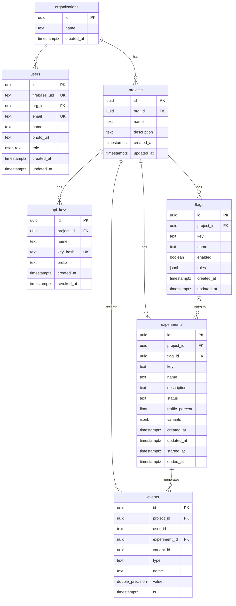

# Entity Relationship Diagram

## Notes

- `experiments.variants` — JSONB array of `{id, key, name, weight}` objects. `variant_id` in `events` references a variant by UUID stored within this array — there is no separate `variants` table.
- `events.user_id` — external identifier (string from the client application), not a FK to `users`.
- `api_keys.key_hash` — only the hash is stored; the raw key is returned once on creation and never persisted.
- `flags.rules` — JSONB array of targeting rules (e.g. `[{"type": "percentage", "value": 0.5}]`).
- `users.org_id` — `ON DELETE SET NULL`; a user can exist without an organization.
- All other FK relations use `ON DELETE CASCADE`.
